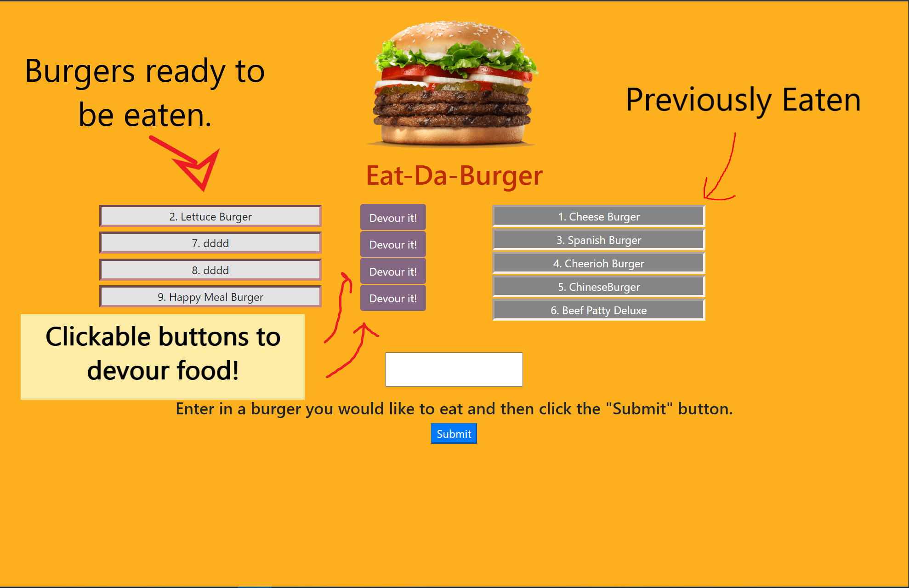

# **The Burger app**

by David Yennerell a.k.a Granderojo17 on 07/06/20


## **Description**
(place for link)

A web page where you can submit a burger to the list of sandwiches and choose to "devour" the sandwhich or not. Clickable buttons and a text box where you can add a new type of buger if you wish.

## **_Table of Contents_**

  * [Installation](#installation)
  * [Usage](#usage)
  * [Contributing](#contributing)
  * [Questions](#questions)



# **Installation**

### To install necessary dependencies, run the following command:

Follow the link to the heroku hosted site or clone.
You must also have node js. so look for the dependencies.
```json
npm i
```
Download the proper dependencies & enjoy!
For example I use this line in terminal
```
nodemon server.js
```

# **Usage**

Build a menu of bugers you would like to eat and then click the 
"Devour it!' button to "eat" the selected burger.

### This project is licensed under the MIT license.

# **Contributing**

none other contributers 

# **Questions**

If you have any questions feel free to contact me at david.yennerell@gmail.com or at my github below.

# **Username/Info**

Created by
Granderojo17


